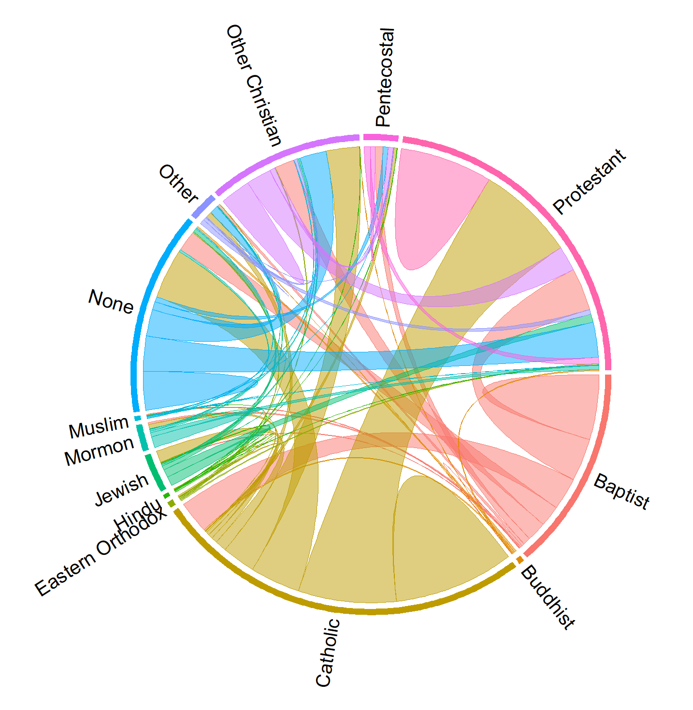

```{r echo = FALSE, message = FALSE, warning=FALSE}
library(foreign)
library(curl)
library(skimr)
library(tidyverse)
library(circlize)
# library(chorddiag)
library(janitor)
library(kableExtra); options(knitr.table.format = "html")
```


Also known as "radial network diagrams", chord diagrams are useful for representing connections between groups ("nodes"). The nodes are circularly arranged and relationships are represented using "chords" connecting two nodes. The chords can carry directional relationships or non-directional relationships. This is a very visually pleasing way to represent relationships and is a powerful method of visualizing large datasets. There is, however, a steep learning curve when it comes to creating chord diagrams. Below I will outline two methods, first I will use the `circlize` package to create a static diagram and then I will use the `chorddiag` package to create an interactive diagram. For more information on how to build chord diagrams using `circlize`, see [Circular Visualization in R](https://jokergoo.github.io/circlize_book/book/) by Zuguang Gu (the creator of the `circlize` package). The documentation for `circlize` can be found [here](https://github.com/jokergoo/circlize). There is some useful information on the [R Graph Gallery chord diagram page](https://www.r-graph-gallery.com/chord-diagram) (more [here](https://www.r-graph-gallery.com/123-circular-plot-circlize-package-2.html) and [here](https://www.r-graph-gallery.com/122-a-circular-plot-with-the-circlize-package.html)). For more information on the `chorddiag` package, you can find the documentation [here](https://github.com/mattflor/chorddiag). For an explanation of all of the variables you can customize, see [additional documentation here](https://github.com/mattflor/chorddiag/blob/master/R/chorddiag.R).

{width=80%}

# The Data: How Couples Meet and Stay Together

The datset is from Stanford's [How Couples Meet and Stay Together](https://data.stanford.edu/hcmst) research project. The dataset contains responses from 4,000 individuals and describes the relationships in their lives. The researchers then followed up on the respondents over several years to track their relationships over time. There are 300+ variables in this dataset. Here I focused on the religious identities of the couples surveyed.

### A glimpse of the data: What are the religious compositions of partners?

```{r echo = FALSE, message = FALSE, warning = FALSE}
hcmst <- read.dta("HCMST_ver_3.04.dta")

# Pull out variables pertaining to religion
religion <- hcmst %>% select(caseid_new, contains("religion"))

# Select for the `religion at 16` variables for the respondent and their partners
religion_16 <- religion %>% 
  select(respondent_religion_at_16, partner_religion_at_16) %>% 
  # Clean up the variable names
  rename(Respondent = respondent_religion_at_16, 
         Partner = partner_religion_at_16) %>% 
  na.omit() %>% 
  mutate(Respondent = case_when(Respondent == "catholic" ~ "Catholic",
                                Respondent == "protestant (e.g. methodist, lutheran, presbyterian, episcopal)" ~ "Protestant",
                                Respondent == "baptist - any denomination" ~ "Baptist",
                                Respondent == "none" ~ "None",
                                Respondent == "other christian" ~ "Other Christian",
                                Respondent == "jewish" ~ "Jewish",
                                Respondent == "other" ~ "Other",
                                Respondent == "refused" ~ "NA",
                                Respondent == "mormon" ~ "Mormon",
                                Respondent == "muslim" ~ "Muslim",
                                Respondent == "buddhist" ~ "Buddhist",
                                Respondent == "eastern orthodox" ~ "Eastern Orthodox",
                                Respondent == "other non-christian, please specify" ~ "Other",
                                Respondent == "hindu" ~ "Hindu",
                                Respondent == "pentecostal" ~ "Pentecostal"),
         Partner = case_when(Partner == "catholic" ~ "Catholic",
                                Partner == "protestant (e.g. methodist, lutheran, presbyterian, episcopal)" ~ "Protestant",
                                Partner == "baptist - any denomination" ~ "Baptist",
                                Partner == "none" ~ "None",
                                Partner == "other christian" ~ "Other Christian",
                                Partner == "jewish" ~ "Jewish",
                                Partner == "other" ~ "Other",
                                Partner == "refused" ~ "NA",
                                Partner == "mormon" ~ "Mormon",
                                Partner == "muslim" ~ "Muslim",
                                Partner == "buddhist" ~ "Buddhist",
                                Partner == "eastern orthodox" ~ "Eastern Orthodox",
                                Partner == "other non-christian, please specify" ~ "Other",
                                Partner == "hindu" ~ "Hindu",
                                Partner == "pentecostal" ~ "Pentecostal")) %>% 
  filter(Respondent != "NA") %>% filter(Partner != "NA") %>% # Get rid of NA values
  arrange(Respondent, Partner) # Arrange descending by respondent, then partner

# I don't care of the directionality of the relationship so I need to combine repeated combinations (ie. Baptist-Catholic and Catholic-Baptist)
# The table has replicates separated by the diagonal, so I'm going to make a dataframe for each half of the table (upper "triangle" and lower "triangle") and then combine them with the appropriate pairings added together
religion_16_tabyl <- religion_16 %>% tabyl(Respondent, Partner)

uppertabyl <- religion_16_tabyl %>% replace(lower.tri(., diag=T), NA) %>% 
  mutate(Respondent = religion_16_tabyl$Respondent) %>% 
  reshape2::melt() %>% 
  rename(Partner = variable, Val2 = value) %>% 
  arrange(Respondent) %>% 
  na.omit(Val2) %>% 
  unite(RP, Respondent, Partner, sep = "-", remove = FALSE) %>% 
  select(RP, Val2)

lowertabyl <- religion_16_tabyl %>% replace(upper.tri(., diag=F), NA) %>% 
  reshape2::melt() %>% 
  rename(Partner = variable, Val1 = value) %>% 
  rename(Respondent = Partner, Partner = Respondent) %>%
  select(Respondent, Partner, everything()) %>% 
  arrange(Respondent) %>% 
  na.omit(Val1) %>% 
  unite(RP, Respondent, Partner, sep = "-", remove = FALSE) %>% 
  select(RP, Val1)

# In order to add the values from upper an lower, I need to make NA values  0
religion_16_summary <- full_join(uppertabyl, lowertabyl, by = "RP") %>% 
  mutate(Val2 = case_when(Val2 == "NA" ~ 0,
                          is.na(Val2) ~ 0,
                          Val2 != "NA" ~ Val2)) %>% 
  mutate(Val1 = case_when(Val1 == "NA" ~ 0,
                          is.na(Val1) ~ 0,
                          Val1 != "NA" ~ Val1)) %>% 
  mutate(Value = Val1 + Val2) %>% 
  filter(Value != 0) %>% 
  separate(RP, into = c("Respondent", "Partner"), sep = "-", remove = TRUE) %>% 
  select(Respondent, Partner, Value)


# Display a table of the religion pairings
religion_16_summary %>% head(20) %>% 
  kable(col.names = c("Respondent", "Partner", "Count")) %>% 
  kable_styling(bootstrap_options = "condensed") %>% 
  column_spec(1, bold = T)
```


# Representation Description

One of the variables in the dataset is the religion of the responent and their partner when they were 16. Each node in my chord diagram represents a religion. Chords connecting the nodes illustrate the religion of the respondent on one end of the chord and their partner on the other end of the chord. In many cases the respondent had the same religious identity as their partner, in which case the chord loops back on itself and looks more like a bump. The thickness of the chord corresponds to the number of partners of that particular religous identity composition. Each node is assigned a color to aid in interpretation. The color of a chord corresponds to the node from which the chord stems from. Transparency was used to aid in the perception of overlapping chords.

# How to interpret

Chord diagrams are best used to communicate broad concepts rather than specifics. From this representation it becomes immediately apparent that a very common religious pairing occurs between Catholics and Protestants. It is also common for partners to share the same religious identity. A side effect of this representation is that we can learn something about the religious composition of the participants that were surveyed; most respondents were Protestant, Baptist, or Catholic.

# Presentation Tips

Many aspects of the diagram can be customized if you're using the `circlize` package. The package creator has an entire book on the topic available online: [Circular Visualization in R](https://jokergoo.github.io/circlize_book/book/). You can indicate directionality of the chords using arrowheads, which I disabled in my diagrams. You can also change the appearance of within-node chords such that they look like little bumps instead of a chord turned in on itself, which I find easier to understand. Depending on the level of detail that you are trying to convey with your diagram, you might opt to eliminate smaller chords by setting a threshold for chord thickness.

# Variations and Alternatives

Another way to represent relationships between groups is through a Sankey or Alluvial diagram. These are very similar to chord diagrams except that the relationship is conveyed through a line connecting two columns and can thus show a larger number of relationships due to the linear layout. Alternatively, network diagrams and arc diagrams can also be useful for communicating relationships.

## The Chord Diagrams

### Static Chord Diagram Using `circlize`

```{r fig.width = 8, fig.height = 8, fig.path="static"}
# Define colors
gridcolors <- c(Baptist = "#F8766D",
                Buddhist = "#E18A00",
                Catholic = "#BE9C00",
                `Eastern Orthodox` = "#8CAB00",
                Hindu = "#24B700",
                Jewish = "#00BE70",
                Mormon = "#00C1AB",
                Muslim = "#00BBDA",
                None = "#00ACFC",
                Other = "#8B93FF",
                `Other Christian` = "#D575FE",
                Pentecostal = "#F962DD",
                Protestant = "#FF65AC")

chordcolors <- religion_16_summary %>% mutate(Color = case_when(Respondent == "Baptist" ~ "#F8766D",
                                                                Respondent == "Buddhist" ~ "#E18A00",
                                                                Respondent == "Catholic" ~ "#BE9C00",
                                                                Respondent == "Eastern Orthodox" ~ "#8CAB00",
                                                                Respondent == "Hindu" ~ "#24B700",
                                                                Respondent == "Jewish" ~ "#00BE70",
                                                                Respondent == "Mormon" ~ "#00C1AB",
                                                                Respondent == "Muslim" ~ "#00BBDA",
                                                                Respondent == "None" ~ "#00ACFC",
                                                                Respondent == "Other" ~ "#8B93FF",
                                                                Respondent == "Other Christian" ~ "#D575FE",
                                                                Respondent == "Pentecostal" ~ "#F962DD",
                                                                Respondent == "Protestant" ~ "#FF65AC"))
chordcolors <- chordcolors$Color %>% unlist()


# Create the chord diagram
circos.clear()
par(mar = c(0, 0, 0.5, 0)) # left, right, top, bottom: add margin around circle
circos.par(cell.padding = c(0, 0, 0, 0),
           gap.degree = 1,
           canvas.ylim = c(-0.6, 0.8), # change the y limits of the canvas
           canvas.xlim = c(-1.1, 1.1)) # change the x limits of the canvas
chordDiagram(religion_16_summary,
             transparency = 0.5, 
             grid.col = gridcolors, 
             link.lwd = 0.5, # border line width
             link.lty = 1, #  border line type
             link.border = chordcolors, # border line color
             link.sort = TRUE, link.decreasing = TRUE, # Control the positioning of the sector links to minimize crossings
             self.link = 1, # Make self-links humps, not chords ( = 2 for chords)
             annotationTrack = "grid", # We'll plot the labels later
             annotationTrackHeight = 0.02, # Height for the annotation "grid"
             preAllocateTracks = 1, # Pre allocate a track and later the sector labels will be added
             directional = FALSE, # There is no directionality to the connections
             order = religion_16_summary$Respondent) # Order according the the respondent first, partner second

# Since each respondent is a sector, we need to use `draw.sector` to add annotation grids for regions which go across several religions
first = tapply(religion_16_summary$Respondent, religion_16_summary$Partner, function(x) x[1])
last = tapply(religion_16_summary$Respondent, religion_16_summary$Partner, function(x) x[length(x)])
for(i in seq_along(first)) {
    start.degree = get.cell.meta.data("cell.start.degree", sector.index = first[i], track.index = 1)
    end.degree = get.cell.meta.data("cell.end.degree", sector.index = last[i], track.index = 1)
    rou1 = get.cell.meta.data("cell.bottom.radius", sector.index = first[i], track.index = 1)
    rou2 = get.cell.meta.data("cell.top.radius", sector.index = last[i], track.index = 1)
    draw.sector(start.degree, end.degree, rou1, rou2, border = NA, col = "white")
}

# Since default text facing in `chordDiagram` is fixed, we need to manually add text in track 1
for(si in get.all.sector.index()) {
    xlim = get.cell.meta.data("xlim", sector.index = si, track.index = 1)
    ylim = get.cell.meta.data("ylim", sector.index = si, track.index = 1)
    circos.text(mean(xlim), ylim[1], si, facing = "clockwise", adj = c(0, 0.5),
    niceFacing = TRUE, cex = 1.25, col = "black", sector.index = si, track.index = 1)
}
```

<!-- ### Interactive Chord Diagram Using `chorddiag` -->

<!-- For `chorddiag` the data needs to be organized as a matrix, but the subsequent coding for the diagram is much simpler. -->

<!-- ```{r echo = FALSE, message = FALSE, warning = FALSE} -->
<!-- religion_16_tabyl <- religion_16 %>% tabyl(Respondent, Partner) -->

<!-- religionmelt <- religion_16_tabyl %>% reshape2::melt() -->

<!-- religionmatrix <- matrix(religionmelt$value %>% unlist(), -->
<!--                          byrow = TRUE, -->
<!--                          nrow = 13, ncol = 13) -->
<!-- religions <- religion_16_tabyl$Respondent %>% unlist() -->
<!-- dimnames(religionmatrix) <- list(Respondent = religions, -->
<!--                                  Partner = religions) -->

<!-- religionmatrix %>%  -->
<!--   kable() %>%  -->
<!--   kable_styling(bootstrap_options = "condensed") %>%  -->
<!--   column_spec(1, bold = T) -->
<!-- ``` -->

<!-- ```{r fig.height=8, fig.width=9, warning = FALSE, message = FALSE} -->
<!-- # Define colors -->
<!-- diagcolors <- c("#F8766D", "#E18A00", "#BE9C00", "#8CAB00", "#24B700", "#00BE70", "#00C1AB", "#00BBDA", "#00ACFC", "#8B93FF", "#D575FE", "#F962DD", "#FF65AC") -->

<!-- # Create the chord diagram -->
<!-- chorddiag(religionmatrix,  -->
<!--           type = "directional", -->
<!--           groupColors = diagcolors,  -->
<!--           groupnamePadding = 5, groupnameFontsize = 18, -->
<!--           chordedgeColor = "", -->
<!--           showTicks = FALSE, -->
<!--           showZeroTooltips = FALSE) -->
<!-- ``` -->