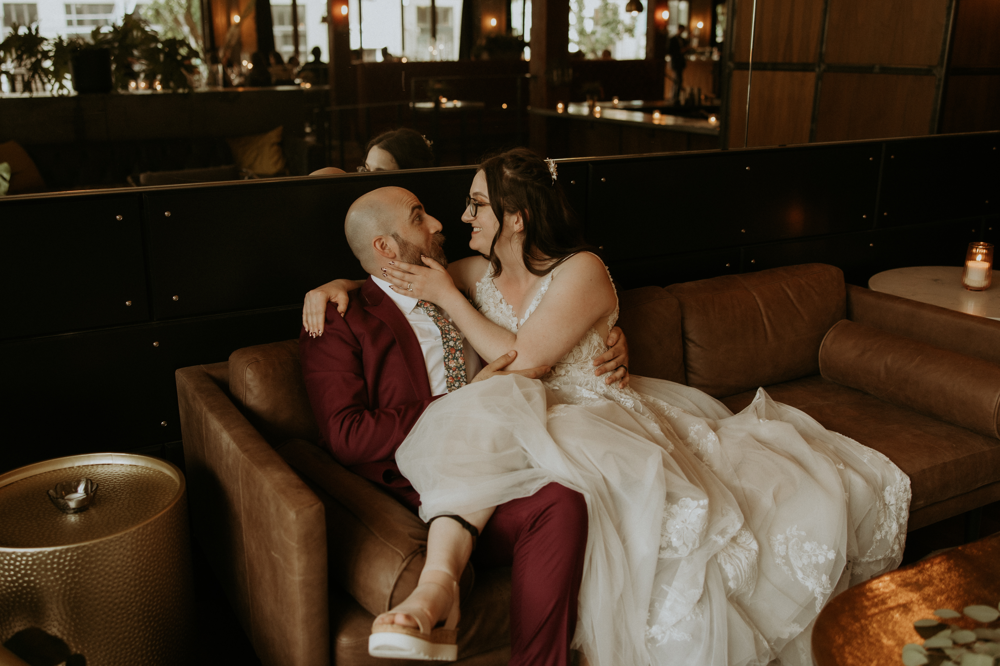

```{r setup, include=FALSE}
knitr::opts_chunk$set(echo = TRUE, message = FALSE, warning = FALSE, fig_retina = 1, fig.path = "static")
```

```{r fig.height=5, fig.width=9, echo=FALSE, fig.showtext = TRUE}
library(jsonlite)
library(tidyverse)
library(lubridate)
library(slider)
library(jpeg)
library(patchwork)
library(showtext)
library(extrafont)

colors <- c("RR" = "#DDCB68", "JJ" = "#D84F7D")
font_add_google("Montserrat") # default font
font_add_google("Codystar") # decorative dot font
showtext_auto(enable = TRUE)

load("final.RData")
final
```


I love data, so I wanted to somehow plot my wedding day. My now-husband wore his Fitbit on his wrist and I wore mine on my ankle (you can see it in the picture below). Fast-forward to eight months later and I have finally gotten around to plotting out our heart rate data. I designed it to match our wedding invites.




Let's get into it.

```{r eval = FALSE}
# Load packages
library(jsonlite)
library(tidyverse)
library(lubridate)
library(slider)
library(jpeg)
library(patchwork)
library(extrafont)
library(showtext)
```


## Data Wrangling 

I used the `jsonlite` package to read in the heart rate data and format it nicely as a tibble. I then "normalized" our heart rates - mine runs about 5 bpm higher than my partner's on average and I wanted them to have the same baseline. I then went through and annotated where we were for each timepoint - getting ready, at the church, at the rose garden, and at the reception. Because this data is all tied to time of day I found the `lubridate` package necessary. Finally, I used the `slider` package to calculate a rolling average of our heart rates to smooth the data a little bit.

```{r}
# read in json files
hr_jj <- read_json("jj_heart_rate-2022-07-09.json", simplifyVector = TRUE) %>% 
  as_tibble() %>% mutate(Name = "JJ")
hr_rr <- read_json("rr_heart_rate-2022-07-09.json", simplifyVector = TRUE) %>% 
  as_tibble() %>% mutate(Name = "RR")

# normalize baselines
hr_jj_min <- hr_jj$value$bpm %>% sort() %>% .[1:10] %>% mean() %>% as.integer() - 60
hr_rr_min <- hr_rr$value$bpm %>% sort() %>% .[1:10] %>% mean() %>% as.integer() - 60 + 5
hr <- full_join(hr_jj, hr_rr) %>% 
  mutate(bpm_norm = case_when(Name == "JJ" ~ value$bpm - hr_jj_min,
                              Name == "RR" ~ value$bpm - hr_rr_min))

# annotate events
hr$dateTime <- hr$dateTime %>% mdy_hms()

getting_ready_start <- ymd_hm("2022-07-09 8:50AM")
ceremony_start <- ymd_hm("2022-07-09 1:00PM")
ceremony_end <- ymd_hm("2022-07-09 2:15PM")
rose_garden_start <- ymd_hm("2022-07-09 3:00PM")
rose_garden_end <- ymd_hm("2022-07-09 4:15PM")
reception_start <- ymd_hm("2022-07-09 4:30PM")
reception_end <- ymd_hm("2022-07-09 9:30PM")

hr <- hr %>% 
  mutate(events = case_when(dateTime > getting_ready_start & dateTime < ceremony_start ~ "getting ready",
                            dateTime > ceremony_start & dateTime < ceremony_end ~ "ceremony",
                            dateTime > rose_garden_start & dateTime < rose_garden_end ~ "rose garden",
                            dateTime > reception_start & dateTime < reception_end ~ "reception"))

hr$events <- hr$events %>% as_factor() %>% fct_relevel("getting ready", "ceremony", "rose garden", "reception")

# create rolling average
hr <- hr %>% 
  mutate(bpm_smooth = slide_dbl(bpm_norm, mean, .before = 10, .after = 10))
```

```{r echo = FALSE}
hr %>% filter(!is.na(events)) %>% head(10)
```

## Making the Base Graph

We have to start somewhere: here is what the basic bpm vs time line graph looks like without much customization.

```{r}
hr %>% 
  filter(dateTime < as.Date("2022-07-10")) %>% 
  ggplot(aes(x = dateTime, y = bpm_smooth)) +
  geom_line(aes(color = Name)) +
  scale_x_datetime(date_breaks = "1 hour", date_labels = "%l%p")
```

I knew I wanted to break the data up into time windows indicating the different parts of the day so I first tried using `facet_wrap()` to get a quick look at how that would shake out.

```{r}
hr %>% 
  filter(dateTime < as.Date("2022-07-10"),
         !is.na(events)) %>% 
  ggplot(aes(x = dateTime, y = bpm_smooth)) +
  geom_line(aes(color = Name)) +
  facet_wrap(~events, nrow = 1, scales = "free_x") +
  scale_x_datetime(date_breaks = "1 hour", date_labels = "%l%p")
```

The facets really helped to contextualize the signal, which I liked, but because the different events were different lengths of time I needed the facets to be different sizes. For customizing at this degree I really like using the `patchwork` package which lets you stitch together individual graphs with a custom layout. Now instead of using one graph with facets, I'm stitching together 4 graphs and specifying the size of each.

```{r}
getting_ready <- hr %>% 
  filter(dateTime < as.Date("2022-07-10"),
         events == "getting ready") %>% 
  ggplot(aes(x = dateTime, y = bpm_smooth)) +
  geom_line(aes(color = Name)) +
  scale_x_datetime(date_breaks = "1 hour", date_labels = "%l%p") +
  ylim(c(60,125)) +
  labs(title = "Getting Ready") +
  theme(axis.title.x = element_blank())

ceremony <- hr %>% 
  filter(dateTime < as.Date("2022-07-10"),
         events == "ceremony") %>% 
  ggplot(aes(x = dateTime, y = bpm_smooth)) +
  geom_line(aes(color = Name)) +
  scale_x_datetime(date_breaks = "1 hour", date_labels = "%l%p") +
  ylim(c(60,125)) +
  labs(title = "Ceremony") +
  theme(axis.title.x = element_blank(), axis.title.y = element_blank())

rose_garden <- hr %>% 
  filter(dateTime < as.Date("2022-07-10"),
         events == "rose garden") %>% 
  ggplot(aes(x = dateTime, y = bpm_smooth)) +
  geom_line(aes(color = Name)) +
  scale_x_datetime(date_breaks = "1 hour", date_labels = "%l%p") +
  ylim(c(60,125)) +
  labs(title = "Rose Garden") +
  theme(axis.title.y = element_blank())

reception <- hr %>% 
  filter(dateTime < as.Date("2022-07-10"),
         events == "reception") %>% 
  ggplot(aes(x = dateTime, y = bpm_smooth)) +
  geom_line(aes(color = Name)) +
  scale_x_datetime(date_breaks = "1 hour", date_labels = "%l%p") +
  ylim(c(60,125)) +
  labs(title = "Reception") +
  theme(axis.title.x = element_blank(), axis.title.y = element_blank())

layout <- c("AAAABCDDDDD")

getting_ready + ceremony + rose_garden + reception + plot_layout(design = layout, guides = "collect") & 
  theme(legend.position = "bottom")
```

This was where I started to see the bones of the final product: I started customizing.

## Building the Final Graph

The final graph is actually two parts stitched together: the top part is the actual graph part, and the bottom part just contains the text and flowers images. I used `patchwork` again to stitch them together.

### The "Graph" Graph

For the graph portion I basically used the same code as above, but started to adjust the theme heavily. I used the `extrafont` and `showtext` packages for fonts, making it easy to download and use fonts from Google Fonts. I talk more about how to do this in my [Sick with Mono](https://jennifer-jahncke.netlify.app/post/sick-with-mono/) post. (I also talk about working with datetime data in the same post.) On top of the graph I also used text and arrow annotations in the graphs to label specific heart rate events.

```{r fig.height=3, fig.width=9, fig.showtext = TRUE}
colors <- c("RR" = "#DDCB68", "JJ" = "#D84F7D")
font_add_google("Montserrat") # default font
font_add_google("Codystar") # decorative dot font
showtext_auto(enable = TRUE)

getting_ready <- hr %>% 
  filter(dateTime < as.Date("2022-07-10"),
         events == "getting ready") %>% 
  ggplot(aes(x = dateTime, y = bpm_smooth)) +
  geom_line(aes(color = Name), size = 0.7) +
  ### add annotation text: friends arriving in the morning
  geom_text(data = tibble(), mapping = aes(x = ymd_hm("2022-07-09 10:59AM"), y = 95), label = toupper("friends arrive"), 
            hjust = 0, vjust = 0, size = 2, family = "Montserrat", color = "#F3EFEF") +
  annotate(geom = "curve", size = 0.3, color = "#F3EFEF",
           x = ymd_hm("2022-07-09 10:55AM"), y = 96, 
           xend = ymd_hm("2022-07-09 10:09AM"), yend = 85, 
           curvature = 0.4, arrow = arrow(length = unit(2, "mm"))) +
  ### 
  scale_x_datetime(date_breaks = "1 hour", date_labels = "%l%p", expand = c(0,0)) +
  ylim(c(60,125)) +
  labs(title = toupper("Getting Ready")) +
  scale_color_manual(values = colors) +
  theme_bw() +
  theme(axis.title.x = element_blank(),
        axis.text.y = element_text(family = "Montserrat", color = "#F3EFEF"),
        plot.title = element_text(family = "Montserrat", color = "#F3EFEF", size = 10, vjust = -2.5, lineheight = 0.8),
        legend.position = c(0.3,0.85),
        legend.direction = "horizontal",
        legend.title = element_blank(),
        legend.background = element_rect(fill = "transparent", color = "#F3EFEF", size = 0.7),
        legend.text = element_text(family = "Montserrat", color = "#F3EFEF"),
        legend.key = element_rect(fill = "transparent"))

ceremony <- hr %>% 
  filter(dateTime < as.Date("2022-07-10"),
         events == "ceremony") %>% 
  ggplot(aes(x = dateTime, y = bpm_smooth)) +
  geom_line(aes(color = Name), size = 0.7) +
  ### add annotation text: walking down the aisle
  geom_text(data = tibble(), mapping = aes(x = ymd_hm("2022-07-09 1:27PM"), y = 107), 
            label = str_wrap(toupper("walking down the aisle"), width = 8),
            hjust = 0.5, vjust = 0, size = 2, family = "Montserrat", color = "#F3EFEF", lineheight = 0.8) +
  annotate(geom = "curve", size = 0.3, color = "#F3EFEF",
           x = ymd_hm("2022-07-09 1:25PM"), y = 105,
           xend = ymd_hm("2022-07-09 1:25PM"), yend = 93,
           curvature = 0, arrow = arrow(length = unit(2, "mm"))) +
  ### 
  scale_x_datetime(date_breaks = "1 hour", date_labels = "%l%p") +
  ylim(c(60,125)) +
  labs(title = toupper("Ceremony")) +
  scale_color_manual(values = colors) +
  theme_bw() +
  theme(axis.title.x = element_blank(), axis.title.y = element_blank(),
        axis.text.y = element_blank(),
        plot.title = element_text(family = "Montserrat", color = "#F3EFEF", size = 10, vjust = -2.5, hjust = 0.5, lineheight = 0.8),
        legend.position = "none")

rose_garden <- hr %>% 
  filter(dateTime < as.Date("2022-07-10"),
         events == "rose garden") %>% 
  ggplot(aes(x = dateTime, y = bpm_smooth)) +
  geom_line(aes(color = Name), size = 0.7) +
  scale_x_datetime(date_breaks = "1 hour", date_labels = "%l%p") +
  ylim(c(60,125)) +
  labs(title = toupper("Rose\nGarden")) +
  scale_color_manual(values = colors) +
  theme_bw() +
  theme(axis.title.x = element_blank(), axis.title.y = element_blank(),
        axis.text.y = element_blank(),
        plot.title = element_text(family = "Montserrat", color = "#F3EFEF", size = 10, vjust = -1, lineheight = 0.8),
        legend.position = "none")

reception <- hr %>% 
  filter(dateTime < as.Date("2022-07-10"),
         events == "reception") %>% 
  ggplot(aes(x = dateTime, y = bpm_smooth)) +
  geom_line(aes(color = Name), size = 0.7) +
  
  ### add annotation text: tequila
  geom_text(data = tibble(), mapping = aes(x = ymd_hm("2022-07-09 5:28PM"), y = 70), 
            label = toupper("tequila"),
            hjust = 0.5, vjust = 0, size = 2, family = "Montserrat", color = "#F3EFEF") +
  annotate(geom = "curve", size = 0.3, color = "#F3EFEF",
           x = ymd_hm("2022-07-09 5:28PM"), y = 73,
           xend = ymd_hm("2022-07-09 5:28PM"), yend = 83,
           curvature = 0, arrow = arrow(length = unit(2, "mm"))) +
  ### 
  
  ### add annotation text: dancing
  geom_text(data = tibble(), mapping = aes(x = ymd_hm("2022-07-09 7:45PM"), y = 120), 
            label = toupper("dancing"),
            hjust = 1, vjust = 0, size = 2, family = "Montserrat", color = "#F3EFEF") +
  annotate(geom = "curve", size = 0.3, color = "#F3EFEF",
           x = ymd_hm("2022-07-09 7:48PM"), y = 120,
           xend = ymd_hm("2022-07-09 8:06PM"), yend = 105,
           curvature = -0.4, arrow = arrow(length = unit(2, "mm"))) +
  ### 
  
  ### add annotation text: couples pictures
  geom_text(data = tibble(), mapping = aes(x = ymd_hm("2022-07-09 7:00PM"), y = 75), 
            label = str_wrap(toupper("couples pictures downtown"), width = 8),
            hjust = 0.5, vjust = 0, size = 2, family = "Montserrat", color = "#F3EFEF", lineheight = 0.8) +
  annotate(geom = "curve", size = 0.3, color = "#F3EFEF",
           x = ymd_hm("2022-07-09 7:00PM"), y = 74,
           xend = ymd_hm("2022-07-09 8:37PM"), yend = 60,
           curvature = 0.3, arrow = arrow(length = unit(2, "mm"))) +
  ### 
  
  scale_x_datetime(date_breaks = "1 hour", date_labels = "%l%p", expand = c(0,0)) +
  ylim(c(60,125)) +
  labs(title = toupper("Reception")) +
  scale_color_manual(values = colors) +
  theme_bw() +
  theme(axis.title.x = element_blank(), axis.title.y = element_blank(),
        axis.text.y = element_blank(),
        plot.title = element_text(family = "Montserrat", color = "#F3EFEF", size = 10, vjust = -2.5, lineheight = 0.8),
        legend.position = "none")

# patching the individual graphs together
layout <- c("AAAABCDDDDD")

pltA <- getting_ready + ceremony + rose_garden + reception + plot_layout(design = layout) & 
  labs(y = toupper("Heart Rate (bpm)")) &
  theme(plot.background = element_rect(fill = "#1E3D42", color = "#1E3D42"),
        panel.background = element_rect(fill = "#1E3D42", color = "#1E3D42"),
        panel.border = element_rect(color = "#F3EFEF", size = 1),
        axis.text.x = element_text(family = "Montserrat", color = "#F3EFEF"),
        axis.title = element_text(family = "Montserrat", color = "#F3EFEF"),
        axis.ticks = element_line(color = "#F3EFEF"),
        panel.grid = element_blank())

pltA
```

### The "Image" Graph

For the decorative portion below the graph I created an "empty" graph using the `ggplot` theme `theme_void()`. I used `ggplot::geom_text()` for the text portions and `patchwork::inset_element()` to add the images. The images I had were just screen grabs from our invite mockups. These were jpeg files that I read in with `jpeg::readJPEG()` and converted to grobs using `grid::rasterGrob()`. `patchwork` doesn't make it easy to flip an image, so I did that outside of R and used two separate images for the two insets.

```{r fig.height=2, fig.width=9, fig.showtext = TRUE}
image_plt <-  ggplot() +
  geom_text(aes(x = 0.5, y = 0), label = toupper("- July 9, 2022 -"),
            hjust = 0.5, vjust = 0, size = 4, family = "Montserrat", color = "#F3EFEF") +
  
  geom_text(aes(x = 0.5, y = 0.35), label = toupper("JJ + RR"),
            hjust = 0.5, vjust = 0, size = 25, family = "Codystar", color = "#F3EFEF") +
  geom_text(aes(x = 0.5, y = 0.15), label = toupper("Jennifer Jahncke & Ramiro Romo Jr."),
            hjust = 0.5, vjust = 0, size = 4, family = "Montserrat", color = "#F3EFEF") +
  
  coord_cartesian(ylim = c(0,1), xlim = c(0.05,1)) +
  inset_element(p = readJPEG("flowers-mirror.jpg", native = FALSE) %>% grid::rasterGrob(), 
                left = -0.05,
                bottom = 0,
                right = 0.25,
                top = 1,) + 
  inset_element(p = readJPEG("flowers.jpg", native = FALSE) %>% grid::rasterGrob(), 
                left = 0.7,
                bottom = 0,
                right = 1,
                top = 1) & 
  theme_void() +
  theme(plot.background = element_rect(fill = "#1E3D42", color = "#1E3D42"),
        panel.background = element_rect(fill = "#1E3D42", color = "#1E3D42"))

image_plt
```


### Putting them together

Now that I have the two separate components (`pltA` and `image_plt`), I used `patchwork` to stitch them together and add a title. I technically made the title as a subtitle but that was just so that I could adjust the theme of the title-title without affecting the titles of the subgraphs. This was lazy - really the titles of the subgraphs should be subtitles and the title of the overall graph should be a title but because of how I had put the graphs together prior to getting to this part I just used this workaround. And here is the final graph!

```{r fig.height=5, fig.width=9, fig.showtext = TRUE}
pltA / image_plt + plot_layout(heights = c(3,2)) + plot_annotation(subtitle = toupper("Heart Beats on Our Wedding Day")) & theme(plot.background = element_rect(fill = "#1E3D42", color = "#1E3D42"),
      plot.subtitle = element_text(family = "Codystar", color = "#F3EFEF", size = 33, hjust = 0.5, vjust = -1.5, face = "bold"))
```

```{r echo = FALSE}
final <- last_plot()
save(final, file = "final.RData")
```

