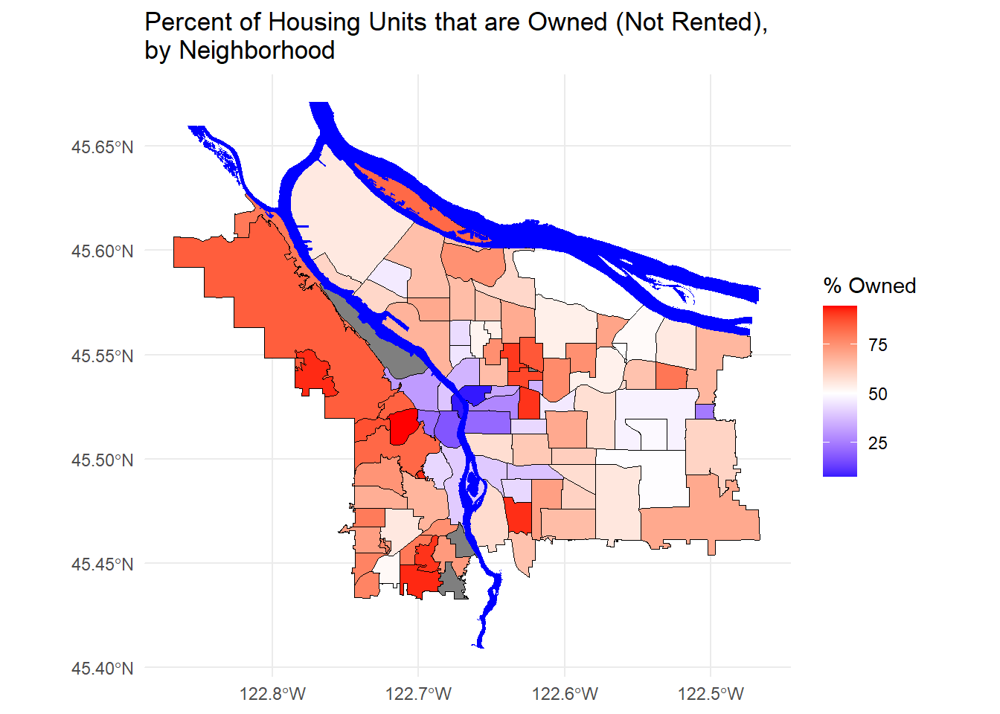

### The Data: Portland, OR 2010 Census Data

Portland provides open access [maps and GIS data](http://www.civicapps.org/datasets) as well as [census data](https://www.portlandoregon.gov/civic/56897). Here I chose to focus on data from each Portland neighborhood describing the number of individuals who either own their housing versus rent their housing. For the map I am also using data describing the layout of the city neighborhoods and the Willamette River.

### The Visualization: Percent of Housing Units that are Owned, by Neighborhood




Here I am using color to indicate the percent of housing units that are owned in a given neighborhood. With this color scale, red indicates that more units are owned than rented and blue indicates that more units are rented than owned. White indicates that an equal number of units are owned and rented. As you can see, in the neighborhoods surroundng the downtown area/city center, more units are rented than owned but in the majority of other neighborhoods the opposite is true.

### The Details: How the Plot was Made

This plot was made using `ggplot2` with `geom_sf` from the `sf` package. The data is organized into shp/shapefile folders and imported using `st_read()` (also part of `sf`). This results in an information-rich dataframe that makes these kinds of plots easy to create.


```r
boundaries_with_pop %>% ggplot() + 
  geom_sf(aes(fill=`Percent Owned`), color = "black") + # plot the neighborhoods
  scale_fill_gradient2(midpoint = 50,
                        low="blue", mid="white", high="red") + # specify the gradient color scale
  geom_sf(data=river_boundaries, fill="blue", color = "transparent") + # plot the river
  labs(title = "Percent of Housing Units that are Owned (Not Rented), \nby Neighborhood",
       fill = "% Owned") +
  theme_minimal()
```

