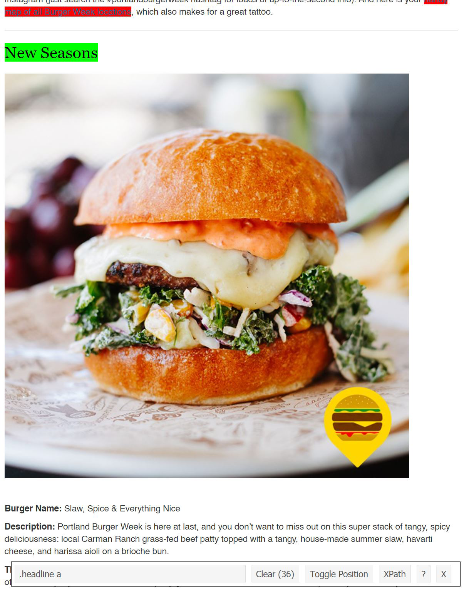

I take the Portland food weeks very seriously. My partner and I make a list of our must-trys and then I make out plan of attack. We usually hit up 2-3 places a night until we've exhausted all the places that we wanted to try. Burger Week is coming up in a couple weeks and I wanted to streamline things a bit: I wanted a spreadsheet of all of the burgers. I knew that web scraping in R was a thing but honestly I had always been a bit intimidated. I had some free time on my hands and figured: now is the time to learn. So I googled a few tutorials and dove straight in. It wound up being so much easier than I thought it would be. Let's learn together.

The tutorial I wound up reading in most detail is [this one](https://www.analyticsvidhya.com/blog/2017/03/beginners-guide-on-web-scraping-in-r-using-rvest-with-hands-on-knowledge/). The reason I liked this tutorial is that it turned me on to this nifty little tool to kinda cheat a little - it's a Chrome extension called [SelectorGadget](https://selectorgadget.com/) that makes finding the relevant CSS elements easy peasy. 

Step 1: install the SelectorGadget extension [here](https://chrome.google.com/webstore/detail/selectorgadget/mhjhnkcfbdhnjickkkdbjoemdmbfginb).

Step 2: In R, install `{rvest}`.


```r
install.packages("rvest")
```

Step 3: Have R read in your website of interest - mine is the [Portland 2021 Burger Week list](https://www.portlandmercury.com/sponsored/burgerweek2021).


```r
library(rvest)
library(tidyverse)
url <- 'https://www.portlandmercury.com/sponsored/burgerweek2021'
webpage <- read_html(url)
```

Step 4: Now go to your website and activate SelectorGadget. Click on the element you want to scrape. For me, I did the restaurant names first. Scroll through the whole page and make sure the only things highlighted green/yellow are things you want. If there are any other elements highlighted, click on them and they will turn red/be excluded.


<center> {width=70%} </center>


The SelectorGadget tells me that the CSS element that I want is `.headline a`. Back in R, lets use that to scrape the restaurant names. Use `html_nodes()` to scrape the element and `html_text2()` to read the text. 


```r
restaurant <- html_nodes(webpage,'.headline a') %>% html_text2()
restaurant
```

```
## character(0)
```

Step 5: Do the same for the rest of the elements you want and you're good to go! Here's my code in entirety:


```r
library(tidyverse)
library(rvest)

url <- 'https://www.portlandmercury.com/sponsored/burgerweek2021'
webpage <- read_html(url)

restaurant <- html_nodes(webpage,'.headline a') %>% html_text2()
burger_name <- html_nodes(webpage, '.blog-body p:nth-child(1)') %>% html_text2()
description <- html_nodes(webpage, '.blog-body p:nth-child(2)') %>% html_text2()
address_hours <- html_nodes(webpage, 'p:nth-child(5) , p:nth-child(4)') %>% html_text2()

# ugh sometimes address is 4th...sometimes it's 5th...must filter.
address_hours <- as.tibble(address_hours) %>% filter(grepl("Address/Hours of Availability",value)) %>% pull()

burger_week <- tibble(restaurant = restaurant,
                      burger_name = burger_name,
                      description = description,
                      address_hours = address_hours)
# cleaning
burger_week <- burger_week %>% 
  separate(burger_name, into = c("trash", "burger_name"), sep = ":", extra = "merge") %>% 
  separate(description, into = c("trash", "description"), sep = ":", extra = "merge") %>%
  separate(address_hours, into = c("trash", "address_hours"), sep = ":", extra = "merge") %>%
  select(restaurant, burger_name, description, address_hours)

write_csv(x = burger_week, path = "burger_week_2021.csv")
```

You can find the resultant .csv file on my [github](https://github.com/jnjahncke/food-weeks/tree/main/burger%20week%202021).

Happy scraping!
