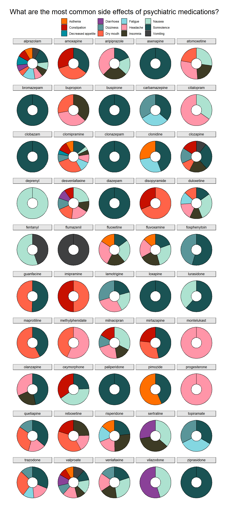

### The Data: SIDER 4.1 Side Effect Resource

From the [website](http://sideeffects.embl.de/):

> SIDER contains information on marketed medicines and their recorded adverse drug reactions. The information is extracted from public documents and package inserts. The available information include side effect frequency, drug and side effect classifications as well as links to further information, for example drug–target relations.

### The Visualization: What are the most common side effects of psychiatric medications?


```
## Warning in inner_join(side_effects, indications, by = "Drug"): Detected an unexpected many-to-many relationship between `x` and `y`.
## Detected an unexpected many-to-many relationship between `x` and `y`.
## ℹ Row 805 of `x` matches multiple rows in `y`.
## ℹ Row 54 of `y` matches multiple rows in `x`.
## ℹ If a many-to-many relationship is expected, set `relationship =
##   "many-to-many"` to silence this warning.
```




### The Details: How the Plot was Made

This plot was made using `ggplot`. It uses `geom_bar` with `coord_theta` to change the bar to a circle. The color scheme is the Futurama palette from the `ggsci` package. Here is a glimpse of the data:


|STITCH       |Drug      |MedDra_code |MedDra_term        | freq_lb| freq_ub|
|:------------|:---------|:-----------|:------------------|-------:|-------:|
|CID100000444 |bupropion |C0004093    |Asthenia           |   0.022|   0.164|
|CID100000444 |bupropion |C0009806    |Constipation       |   0.096|   0.096|
|CID100000444 |bupropion |C0011991    |Diarrhoea          |   0.052|   0.052|
|CID100000444 |bupropion |C0012833    |Dizziness          |   0.064|   0.064|
|CID100000444 |bupropion |C0015672    |Fatigue            |   0.050|   0.050|
|CID100000444 |bupropion |C0018681    |Headache           |   0.191|   0.290|
|CID100000444 |bupropion |C0027497    |Nausea             |   0.096|   0.096|
|CID100000444 |bupropion |C0042963    |Vomiting           |   0.046|   0.170|
|CID100000444 |bupropion |C0043352    |Dry mouth          |   0.150|   0.150|
|CID100000444 |bupropion |C0232462    |Decreased appetite |   0.051|   0.051|

And here is the `ggplot` code:


```r
top12_psych %>% filter(freq_lb >= 0.1) %>% 
ggplot(mapping = aes(x = 1, y=freq_lb, fill = MedDra_term)) + 
  geom_bar(stat = "identity", position = "fill", width = 0.1, color = "black") +
  coord_polar(theta="y") +
  facet_wrap(~Drug, ncol=5) +
  xlim(c(0.9, 1.05)) +
  labs(title = "What are the most common side effects of psychiatric medications?",
       subtitle = " ") +
  theme_void() +
  theme(legend.position = "top",
        legend.title = element_blank(),
        plot.title = element_text(hjust=0.5, size = 20),
        plot.margin = margin(t = 20, r = 0, b = 20, l = 0, unit = "pt"),
        plot.subtitle = element_text(size=1),
        strip.background = element_rect(colour="black", fill="grey90"),
        strip.text = element_text(size = 10, vjust=1, hjust=0.5, margin=margin(3,0,3,0,"pt"))) +
  scale_fill_futurama()
```
