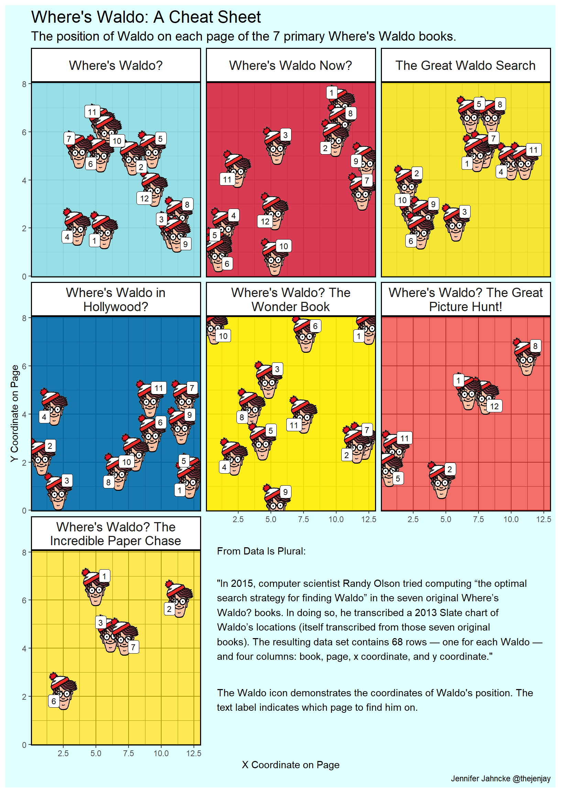
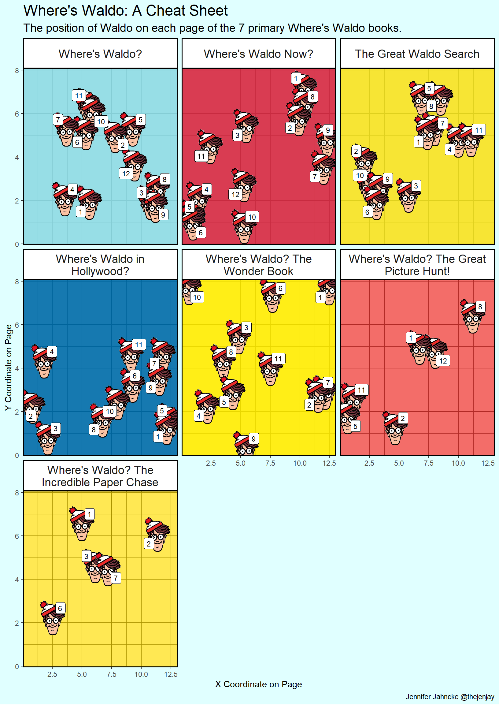

### The Data: Where's Waldo?

This data was found on [Data Is Plural](https://docs.google.com/spreadsheets/d/1wZhPLMCHKJvwOkP4juclhjFgqIY8fQFMemwKL2c64vk/edit#gid=0&range=C291), originally posted January 2017.

From Data Is Plural:

> In 2015, computer scientist Randy Olson tried computing "the optimal search strategy for finding Waldo" in the seven original Where's Waldo? books. In doing so, he transcribed a 2013 Slate chart of Waldo's locations (itself transcribed from those seven original books). The resulting data set contains 68 rows --- one for each Waldo --- and four columns: book, page, x coordinate, and y coordinate.

You can download the CSV from Randy Olson's website archives [here](http://www.randalolson.com/wp-content/uploads/wheres-waldo-locations.csv).

### The Visualization: Where's Waldo?




### The Details: How the Visualization was Made

For this visualization, I used the following packages:


```r
library(tidyverse)
library(ggimage)
library(ggrepel)
library(patchwork)
```

#### Data Wrangling

Here's a glimpse at the data set as provided:


```r
waldo_pos <- read.csv("wheres-waldo-locations.csv")
head(waldo_pos)
```

```
##   Book Page        X        Y
## 1    5   10 0.625000 7.708333
## 2    7    1 4.944444 6.569444
## 3    1   11 5.430556 6.402778
## 4    1   10 5.902778 6.083333
## 5    2    3 5.430556 5.444444
## 6    5    3 4.791667 5.444444
```

The data set is very basic and didn't really require any tidying, but I needed to add three columns: (1) the name of my Waldo .png file (more on this later), (2) the actual name of each book (since the data is provided as the book *number*), and (3) the hex code for the main color of each book cover. To get the hex codes I googled the books, pulled the cover images into photoshop, eyedropped the color, and recorded the corresponding hex. I then used `forcats::fct_relevel()` from {tidyverse} to manually define the factor levels of each book according to the book number/title.


```r
waldo_pos <- waldo_pos %>% mutate(icon = rep("waldo.png", nrow(waldo_pos)))
waldo_pos <- waldo_pos %>% 
  mutate(BookName = case_when(Book == 1 ~ "Where's Waldo?",
                          Book == 2 ~ "Where's Waldo Now?",
                          Book == 3 ~ "The Great Waldo Search",
                          Book == 4 ~ "Where's Waldo in Hollywood?",
                          Book == 5 ~ "Where's Waldo? The Wonder Book",
                          Book == 6 ~ "Where's Waldo? The Great Picture Hunt!",
                          Book == 7 ~ "Where's Waldo? The Incredible Paper Chase"),
         ColorHex = case_when(Book == 1 ~ "#8fdce4",
                              Book == 2 ~ "#d62e45",
                              Book == 3 ~ "#f5e321",
                              Book == 4 ~ "#006da9",
                              Book == 5 ~ "#ffec01",
                              Book == 6 ~ "#ef3834",
                              Book == 7 ~ "#ffdd00"))

waldo_pos$BookName <- waldo_pos$BookName %>% 
  fct_relevel(c("Where's Waldo?", "Where's Waldo Now?", "The Great Waldo Search", "Where's Waldo in Hollywood?", "Where's Waldo? The Wonder Book", "Where's Waldo? The Great Picture Hunt!", "Where's Waldo? The Incredible Paper Chase"))

head(waldo_pos)
```

```
##   Book Page        X        Y      icon
## 1    5   10 0.625000 7.708333 waldo.png
## 2    7    1 4.944444 6.569444 waldo.png
## 3    1   11 5.430556 6.402778 waldo.png
## 4    1   10 5.902778 6.083333 waldo.png
## 5    2    3 5.430556 5.444444 waldo.png
## 6    5    3 4.791667 5.444444 waldo.png
##                                    BookName ColorHex
## 1            Where's Waldo? The Wonder Book  #ffec01
## 2 Where's Waldo? The Incredible Paper Chase  #ffdd00
## 3                            Where's Waldo?  #8fdce4
## 4                            Where's Waldo?  #8fdce4
## 5                        Where's Waldo Now?  #d62e45
## 6            Where's Waldo? The Wonder Book  #ffec01
```

#### Creating the Visualization

This visualization is created by making two visualizations and combining them using {patchwork}. (If you don't know patchwork you should definitely [read up on it](https://patchwork.data-imaginist.com/)! I use it constantly.) The first visualization, the main one, is the "scatter plot" using a Waldo icon as the points. To do this I use the {[ggimage](https://mran.microsoft.com/snapshot/2018-05-23/web/packages/ggimage/vignettes/ggimage.html)} package. I found a Waldo icon online that had a transparent background:

<p align="center">


</p>

I saved the icon as "waldo.png" - this is why I needed that `icon` column in my dataframe! I then used `ggimage::geom_image()` inside `ggplot()` just like I would use `geom_point()` but with the image provided in the aesthetics using `aes(image = icon)`. What else did I do?

-   I used `ggrepel::geom_label_repel()` to add the page number labels. I prefer `geom_label_repel()` over `geom_label()` because it ensures that the labels don't overlap.\
-   I used `facet_wrap()` to plot the 7 books separately. This is why it was important that I specified the factor levels earlier - to ensure that the books were in the proper order. If I had not done that they would have been presented alphabetically. One other tweak I made withing the `facet_wrap()` function was to use `labeller = label_wrap_gen()` to make the book titles wrap if they were too long to fit in the strip width.\
-   I wanted the backgrounds of the facets to correspond to the colors of the book covers. I took a short cut here. It is not trivial to set the panel background colors to be different within a `facet_wrap`. (You can easily change them all to be the *same* color using `theme(panel.background = element_rect(fill = "red")`.) The short cut I took was to use `geom_rect()` to draw a rectangle under the `geom_image()` layer. I set the fill of the rectangle to be the hex codes in my `ColorHex` column and used `scale_fill_identity()` to tell ggplot that the cell values were to be interpreted as color coding information, not factors.


```r
waldo_plot <- waldo_pos %>% 
  ggplot(aes(x = X, y = Y)) +
  geom_rect(aes(fill = ColorHex), xmin = -1, xmax = 14, ymin = -1, ymax = 8.5, alpha = 0.2) +
  geom_image(aes(image = icon), size = 0.2) +
  geom_label_repel(aes(label = Page), size = 3) +
  facet_wrap(~BookName, labeller = label_wrap_gen()) +
  scale_fill_identity() +
  labs(x = "X Coordinate on Page", y = "Y Coordinate on Page",
       title = "Where's Waldo: A Cheat Sheet",
       subtitle = "The position of Waldo on each page of the 7 primary Where's Waldo books.",
       caption = "Jennifer Jahncke @thejenjay") +
  theme_bw() +
  theme(panel.grid = element_line(color = "black"),
        strip.background = element_rect(color = "black", fill = "white", size = 1),
        strip.text = element_text(size = 14),
        plot.title = element_text(size = 18),
        plot.subtitle = element_text(size = 14),
        plot.background = element_rect(fill = "lightcyan"),
        panel.border = element_rect(color = "black", size = 1))
```



Okay but now there's that big empty space in the bottom corner and I want to fill it with a caption describing the data. Here is where {patchwork} comes in. I created a "plot" that is just a blank canvas with my desired caption printed on it using `geom_text()`. I used `str_wrap(label = , width = )` to make my text wrap into a "paragraph" of a specified width (given in characters).


```r
inset <- ggplot() +
  geom_rect(aes(xmin = 0, xmax = 4.5, ymin = -0.25, ymax = 0.25), fill = "transparent") +
  geom_text(aes(x = 0, y = 0.12, label = "From Data Is Plural:"), hjust = 0) +
  
  geom_text(aes(x = 0, y = 0, 
                label = str_wrap('"In 2015, computer scientist Randy Olson tried computing “the optimal search strategy for finding Waldo” in the seven original Where’s Waldo? books. In doing so, he transcribed a 2013 Slate chart of Waldo’s locations (itself transcribed from those seven original books). The resulting dataset contains 68 rows — one for each Waldo — and four columns: book, page, x coordinate, and y coordinate."', width = 70)), 
            hjust = 0) +
  
  geom_text(aes(x = 0, y = -0.14, 
                label = str_wrap("The Waldo icon demonstrates the coordinates of Waldo's position. The text label indicates which page to find him on.", width = 70)), 
            hjust = 0) +
  coord_cartesian(xlim = c(-0.05, 4.5), ylim = c(-0.2,  0.2)) +
  theme_void()
```

Which brings me to my final visualization! I specified the size of the visualization using code chunk options. (`{r fig.width=8.5, fig.height=12}`). The inset is placed using `patchwork::inset_element()`.


```r
waldo_plot + inset_element(inset, 
                           left = 0.32, 
                           bottom = 0, 
                           right = 1, 
                           top = 0.38)
```


