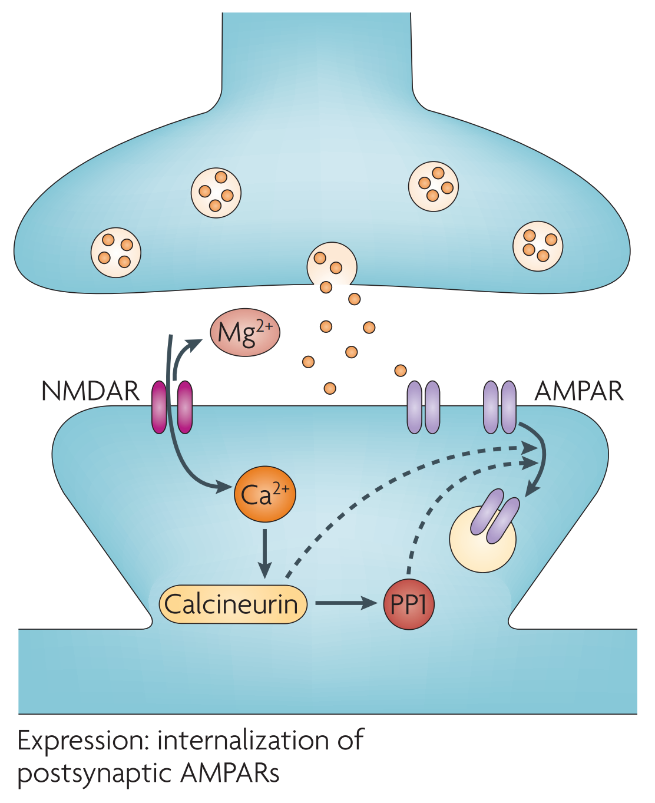
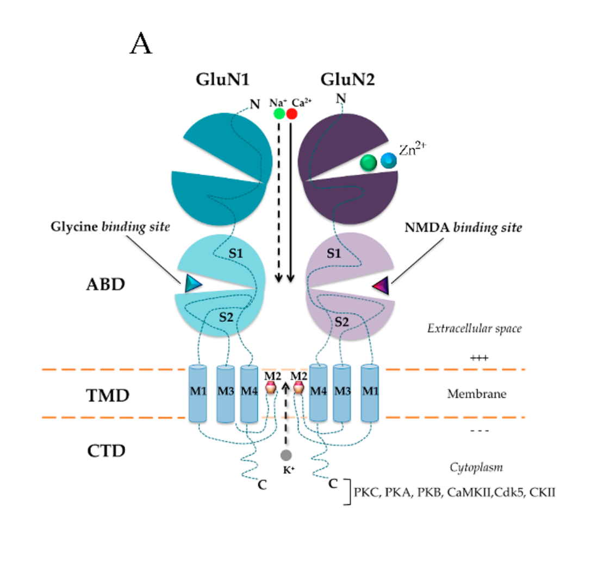
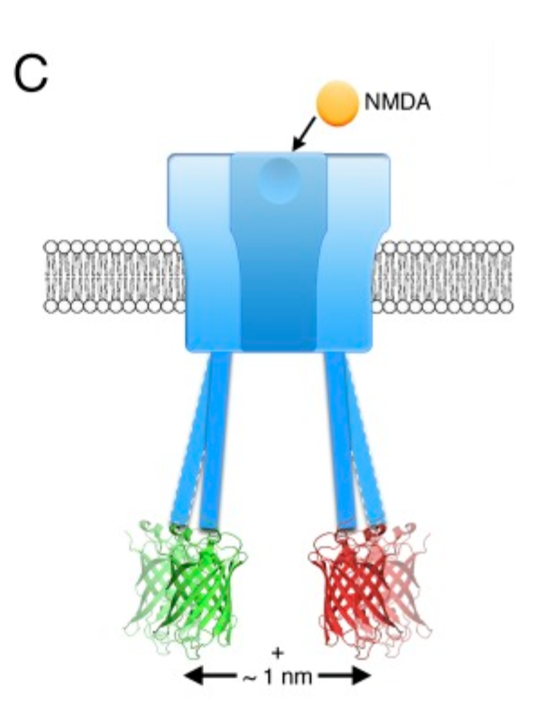
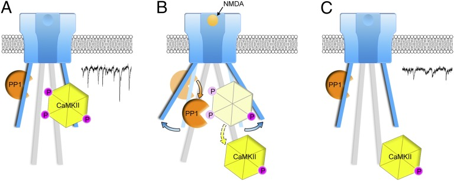
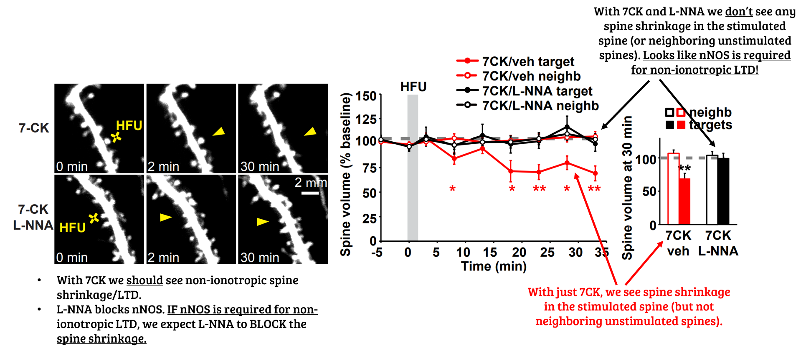
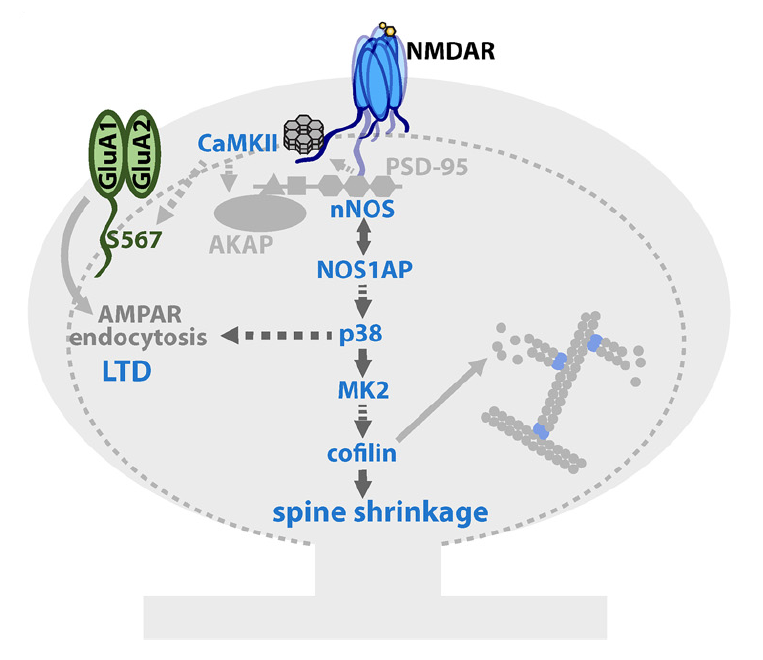

<blockquote class="twitter-tweet">
Preprint featuring one of the projects I worked on during my time as a research assistant! Here we start to put together the molecular signaling pathway downstream of non-ionotropic LTD and spine shrinkage. <a href="https://t.co/MBSfExBzih">https://t.co/MBSfExBzih</a>
&mdash; Jennifer Jahncke (@thejenjay) <a href="https://twitter.com/thejenjay/status/1215690681508757505?ref_src=twsrc%5Etfw">January 10, 2020</a></blockquote> 

.

Brain cells form excitatory synaptic connections on structures called dendritic spines. These spines change size/shape as the synapse strenghtens or weakens. This process is known as synaptic plasticity. One form of synaptic plasticity is long-term depression (LTD) in which the synapse weakens and the spine shrinks. The mechanism by which LTD occurs is often taught as being an "ionotropic" process - meaning that it requires the movement of ions. In the case of LTD, calcium flux through the NMDA receptor has been shown over and over again to be crucial. Glutamate binds to the NMDA receptor, calcium fluxes into the cell and binds PP2B/calcineurin, which dephosphorylates AMPA receptors, leading to AMPA receptor endocytosis and synaptic weakening.

 {width=50%} 

But what is non-ionotropic LTD? To understand this process you first need to know something about NMDA receptors: they require TWO agonists for the ion pore to open: (1) glutamate and (2) glycine or D-serine. If glutamate binds the receptor in the absence of the co-agonist the pore does not open and no calcium can flow through.

  {width=70%} 

Recently-ish (Nabavi et al., 2013) it was found that if glutamate binds WITHOUT the ion pore opening....LTD can still occur. 🤯 (PS - yes, recently-ish was 6-7 years ago...)

   

But there's no calcium influx! So what is going on? Some FRET experiments showed that the intracellular tails of the NMDA receptor move in response to glutamate binding, even in the absence of a co-agonist. This certainly smells like metabotropic signaling. But people didn't like calling it metabotropic because NMDA receptors are ionotropic...fine...we'll call it non-ionotropic signaling.

 {width=30%} 

Before our paper, the only known players in the non-ionotropic signaling pathway were p38 MAPK, CaMKII, and PP1. Here we parse out the signaling pathway, linking NMDA receptor agonism and the associated conformational change to AMPA receptor endocytosis.

   

Our paper uses 2-photon glutamate uncaging to induce LTP at single spines. This results in reduced synaptic strength (assayed with electrophyiology) and spine shrinkage. We then blocked potential signaling molecules and looked to see if this also blocked spine shrinkage.

   

Indeed, we found that CaMKII, nNOS, NOS1AP, p38 MAPK, MK2, and cofilin were all necessary for non-ionotropic spine shrinkage!

{width=50%}

**Update:** This paper has since been [published at J. Neuro!](https://www.jneurosci.org/content/40/19/3741)

#### References:

*  Kauer, J., Malenka, R. Synaptic plasticity and addiction. Nat Rev Neurosci 8, 844–858 (2007). https://doi.org/10.1038/nrn2234  
*  Valdivielso, J.M., Eritja, A., Caus, M., Bozic, M. Glutamate-Gated NMDA Receptors: Insights into the Function and Signaling in the Kidney. Biomolecules 10 (7), 1051 (2020). https://doi.org/10.3390/biom10071051  
*  Nabavi S, Kessels HW, Alfonso S, Aow J, Fox R, Malinow R. Metabotropic NMDA receptor function is required for NMDA receptor-dependent long-term depression. Proc Natl Acad Sci U S A. 2013;110(10):4027-4032. https://doi.org/10.1073/pnas.1219454110  
*  Aow J, Dore K, Malinow R. Conformational signaling required for synaptic plasticity by the NMDA receptor complex. Proc Natl Acad Sci U S A. 2015;112(47):14711-14716. https://doi.org/10.1073/pnas.1520029112  
*  Dore K, Aow J, Malinow R. Agonist binding to the NMDA receptor drives movement of its cytoplasmic domain without ion flow. Proc Natl Acad Sci U S A. 2015;112(47):14705-14710. doi:10.1073/pnas.1520023112  
*  Stein IS, Park DK, Flores JC, Jahncke JN, Zito K. Molecular Mechanisms of Non-ionotropic NMDA Receptor Signaling in Dendritic Spine Shrinkage. J Neurosci. 2020;40(19):3741-3750. doi:10.1523/JNEUROSCI.0046-20.2020  
