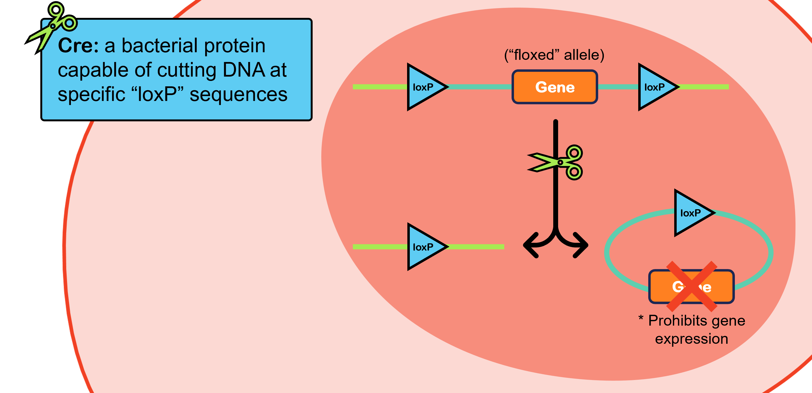
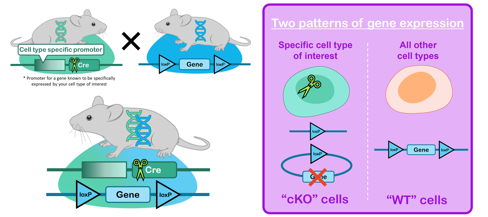
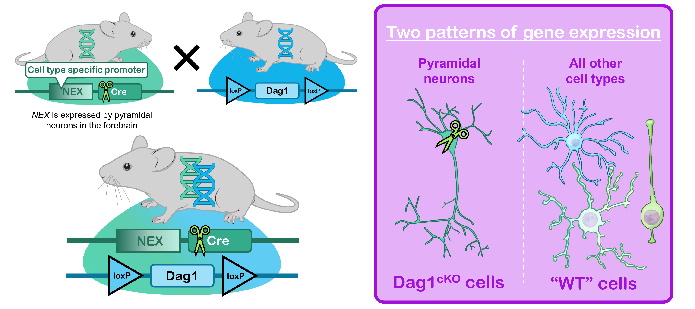
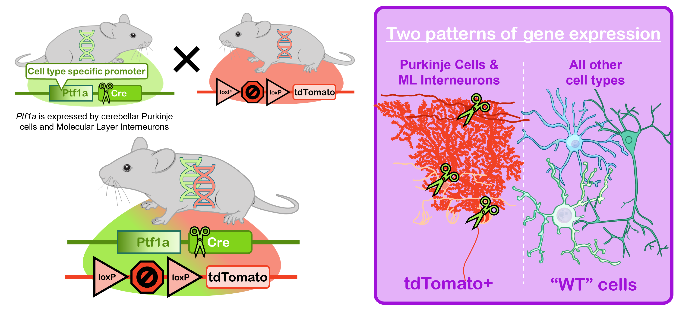
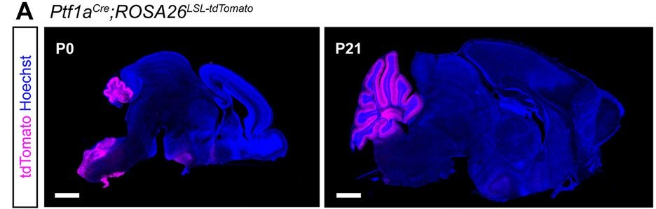

The introduction of conditional genetics represents a huge boon in the health sciences. It used to be that the only way to study the effect a gene had on the biology of a system was to "knock it out" - engineer a model (usually mouse) where the gene, or part of the gene, is missing entirely from the mouse's genome. This was hugely useful for biologists, however there are insurmountable limitations to this approach, namely that the more important a gene is for the animal's development, the more likely the animal is to die early in development in the absence of the gene. Conditional genetics allow us to get around this by targeting the loss of the gene to a particular cell type or defined cluster of cell types. How do we achieve this? The most popular form of conditional genetics is the Cre-lox system, but other variants exist (Flp-frt, Dre-rox), each following the same general concept.

Cre is a protein originally found in bacteria that we are able to exogenously express in mammalian cells. Cre is special because it acts as a pair of molecular scissors that cut DNA, but it's smart enough to only cut DNA at very specific sites, called loxP sites. Each loxP site is the same short sequence of DNA basepairs. Since we know the sequence of a loxP site we can insert them into a mouse's genome wherever we want. By putting one loxP site before a gene and another loxP site after the same gene, we set up Cre to "cut out" the gene, blocking gene expression. We refer to genes floxed by two loxP sites in this manner as a "floxed" gene.

The cell-type specificity of this system is dictated by the pattern of Cre expression - by controlling which cells have the scissors. We do this by expressing Cre under the control of a specific promoter. A good promoter is one that has a known expression pattern both in time and space. Only cells that express the promoter will express Cre, and the timing of the Cre expression is controlled by the timing of the promoter expression. Where Cre and a floxed gene are expressed together, you get a "conditional knockout" or "cKO" of the floxed gene.

An example: *NEX* (AKA *NeuroD6*) is a gene expressed by pyramidal neurons in the forebrain, starting embryonically (so, early in development). If we express Cre under the control of the *NEX* promoter (*NEXCre*), Cre expression will be restricted to pyrmidal cells and the scissors will "turn on" in those cells early in development. If I wanted to delete the gene *Dag1* from pyramidal cells early in development, I need to cross a mouse expressing *NEXCre* to a mouse expressing a floxed version of *Dag1*. The resulting mouse, carrying both transalleles will essentially be chimeric - *NEX+* cells will lose *Dag1* expression, whereas all the other cells in the mouse's body will retain *Dag1* expression. This is useful because a full knockout of Dag1 from the entire animal is lethal during early embryogenesis, whereas a *NEXCre;Dag1cKO* is viable. We have used this to study the role of *Dag1* in the development of the brain.

The invention of CRISPR has made the design of these so-called transgenic mice relatively easy and there are facilities that will design and produce transgenic mice for you. Since the Cre-lox system has been around for a while now, a lot of Cre-expressing mice and floxed mice are available at repositories like The Jackson Laboratory. So for the most part, scientists can just order the pair of Cre and floxed mice necessary for their experiments without having to do any fancy genetic engineering themselves.

## Going Further: Reporter Alleles

Conditional genetics can be used for more than just knocking out a gene from a subset of cells. We can also use conditional genetics to express a transgene (a foreign sequence of DNA) in a defined subset of cells. The most common use of this is to express a fluorescent protein like GFP or tdTomato in Cre-expressing cells. This requires a slightly different approach since we aren't trying to delete a gene in *Cre+* cells, instead we are trying to express a gene only in *Cre+* cells. You instead put a STOP codon in front of the transgene you want to express and flank the STOP codon by loxP sites. This means that in the absence of Cre, the STOP codon will be expressed and there will be no fluorophore expression. But in the presence of Cre, the STOP codon will get removed and the fluorphore will get expressed. This configuration is called lox-stop-lox, or LSL for short. In the example below, I use *Ptf1aCre* to restrict tdTomato expression (a red fluorescent protein) to Purkinje cells and Molecular Layer Interneurons in the cerebellum starting early in development.

And here is what the brain of a *Ptf1aCre;Rosa26LSL-tdTomato* looks like in practice. (Rosa26 is just an available locus that we put the LSL-tdTomato sequence into.) I am showing a sagittal cross section through the whole brain at two timepoints - postnatal days (P) zero and 21. You can see the tdTomato expression is restricted to the cerebellum, as we would expect.

There are even more complicated conditional genetics that are regularly employed that I won't get into. Instead, I will caution you that while these tools are incredible and allow us to do great science, you must never trust a tool to behave as it has been described to. You have to first validate both your Cre line and your floxed line to make sure they are doing what you expect. I cannot stress this enough. I wrote a whole journal article on how long it took me to find a tool that did what I expected it to in my hunt to delete *Dag1* from Purkinje cells early in development. [Read it here if you are interested (open access)!](https://doi.org/10.1523/ENEURO.0149-24.2024)
