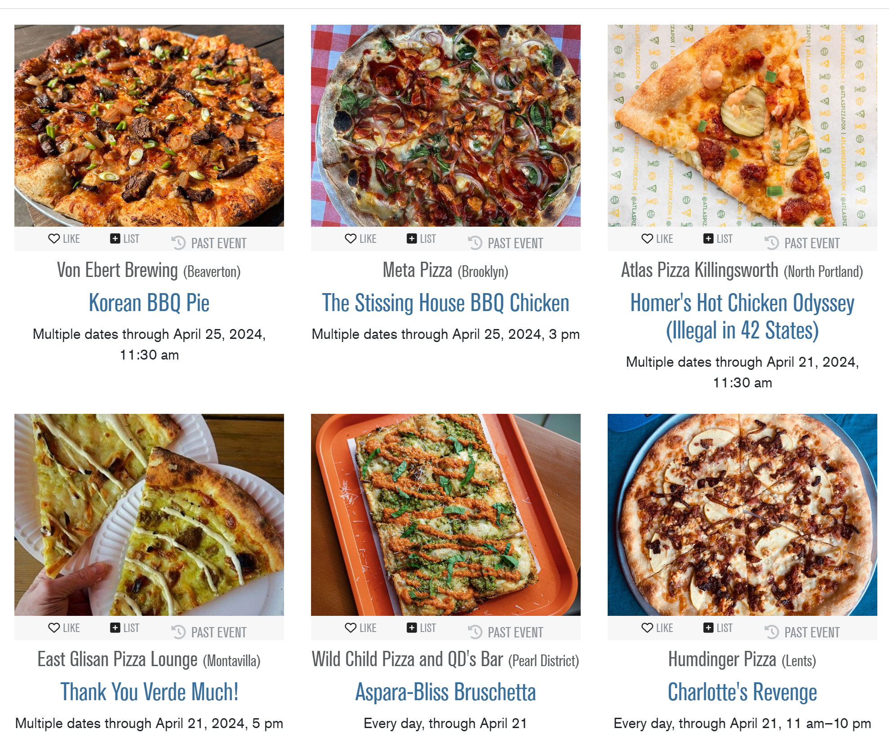
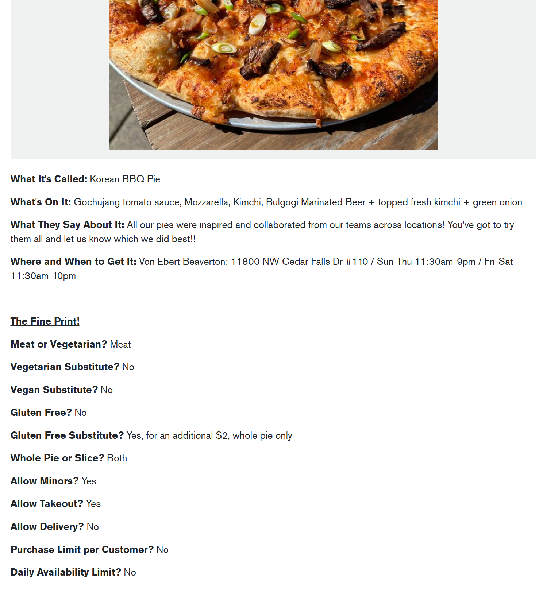
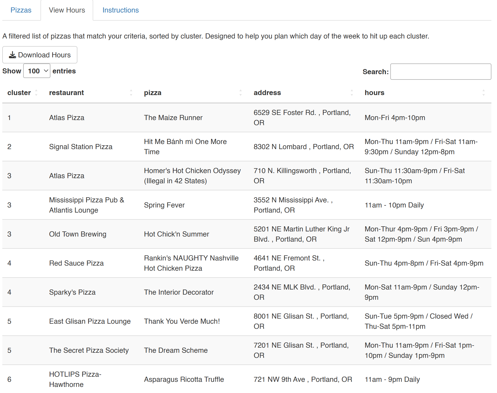

```{r setup, include=FALSE}
knitr::opts_chunk$set(echo = TRUE, message = FALSE, warning = FALSE, fig_retina = 1, fig.path = "static")
```

```{r echo = FALSE}
library(tidyverse)
library(plotly)
```

It's been a while since [I first learned how to scrape websites](https://jennifer-jahncke.netlify.app/post/portland-burger-week-2021/) and boy have I learned a lot since then. So as you may or may not be aware, I primarily use web scraping [to get the most out of Portland's food weeks](https://github.com/jnjahncke/food-weeks). Rather than scrolling through a website listing participating restaurants in Pizza Week, for example, I will scrape that website for all relevant info and create a spreadsheet with all the pizzas. Then my partner and I vote on which pizzas sound worth trying. Unfortunately we love pizza, so there are usually well over 10 pizzas we want to squeeze into 7 days. No worries, we're fine hitting up 2-3 restaurants in a night and just freezing leftover pizza for later. But how to decide on which 2-3 restaurants to hit in one night? The answer is: cluster analysis. I settled on k-means clustering, using GPS coordnates (lat,lon) as the clustering criteria and the number of days we're willing to go out as the number of clusters. I then got even more extra and created a web app that (1) allowed you to vote on the pizzas that interest you OR import a Google spreadsheet with your pizza choices already ranked by interest level and (2) told you which restaurants to hit up in the same night based on k-means clustering.

Unfortunately it looks like Portland has wised up and no longer allows web scraping. (Or maybe they just blocked my IP address specifically...) So Pizza Week 2024 was my last venture into web scraping in this manner. I figured I'd walk you through it anyway though, as I learned so much from this process.

## Web Scraping

I still go about web scraping [the same way I previously described](https://jennifer-jahncke.netlify.app/post/portland-burger-week-2021/). I have gotten better at working more efficiently with cleaner code. And I've had to adapt as The Portland Mercury kept changing the layout of their food week websites. For Pizza Week 2024, the main website contained a bunch of links that you had to click through for each individual pizza, so I wrote code that would loop through every single separate pizza website and gather all the info about each individual pizza.

 

My basic code is here, to see the version where I cleaned the data, [see my github](https://github.com/jnjahncke/food-weeks/blob/main/pizza%20week%202024/pizza-week-2024.R).

```{r eval = FALSE}
library(tidyverse)
library(rvest)

url <- 'https://everout.com/portland/events/the-portland-mercurys-pizza-week-2024/e170026/'
webpage <- read_html(url)

# get restaurant and wing names
restaurants <- html_nodes(webpage, 'h4 a') %>% html_text2()
pizzas <- html_nodes(webpage, 'h3 a') %>% html_text2()
img_links <- html_elements(webpage, '.img-fluid') %>% html_attr("src")

# list of links to wing descriptions
rest_links <- html_nodes(webpage, 'h3 a') %>% html_attr('href')

# label dictionary - will be used to name columns
label_dict <- c("What It's Called:" = "pizza",
                "What's On It:" = "toppings",                 
                "What They Say About It:" = "description",
                "Where and When to Get It:" = "address_hours",      
                "The Fine Print!" = "fine_print",
                "Meat or Vegetarian?" = "meat_veggie",
                "Vegetarian Substitute?" = "veggie_sub",
                "Vegan Substitute?" = "vegan_sub",
                "Gluten Free?" = "gf",
                "Gluten Free Substitute?" = "gf_sub",
                "Whole Pie or Slice?" = "whole_slice",
                "Allow Minors?" = "minors",
                "Allow Takeout?" = "takeout",
                "Allow Delivery?" = "delivery",
                "Purchase Limit per Customer?" = "purchase_limit",
                "Daily Availability Limit?" = "availability_limit")

# loop through pizza links, get info, build pizza data table
pizza_week <- tibble()
for (i in 1:length(rest_links)) {
  url <- rest_links[i]
  webpage <- read_html(url)
  
  
  info <- html_nodes(webpage, '.description') %>% html_text2() %>% .[1]
  labels <- str_match_all(string = info, pattern = "(What It's Called:|What It's Called:|What's On It:|What They Say About It:|Where and When to Get It:|The Fine Print!|Meat or Vegetarian\\?|Vegetarian Substitute\\?|Vegan Substitute\\?|Gluten Free\\?|Gluten Free Substitute\\?|Whole Pie or Slice\\?|Allow Minors\\?|Allow Takeout\\?|Allow Delivery\\?|Purchase Limit per Customer\\?|Daily Availability Limit\\?)")[[1]][,2]
  
  
  # split at each label
  label_list = c()
  for (label in labels){
    label <- str_replace(label,"[?]","\\\\?")
    label_list <- label_list %>% append(label)
  }
  label_list <- paste(unlist(label_list), collapse='|')
  
  info <- info %>% str_split_1(label_list) %>% .[-1]
  
  info2 <- c()
  for (element in info) {
    element <- str_squish(element)
    info2 <- append(info2, str_replace(element, "^ |^[?] ", ""))
  }
  
  # build tibble
  temp_tib <- tibble(pizza = info2[1])
  for (j in seq(2,length(info2))) {
    name <- paste(label_dict[paste0(labels[j][[1]])]) 
    val <- paste0(info2[j])
    temp_tib <- temp_tib %>% mutate(!!name := val) %>% mutate(restaurant = restaurants[i], image = img_links[i])
  }

  if (dim(pizza_week)[1] == 0) {
    pizza_week <- pizza_week %>% bind_rows(temp_tib)
  } else {
    pizza_week <- pizza_week %>% full_join(temp_tib)
    }
  
  rm(info, info2, url, webpage, labels, label_list, temp_tib, name, val, element, i, j)
}

# export
pizza_week %>% select(-image) %>% save(file = "pizza_week.RData")
pizza_week %>% select(-image) %>% write_csv(file = "pizza_week_2024.csv")
```

This is what the pizza_week tibble looked like when I was done with it:

```{r echo = FALSE}
load('pw-app/for_shiny.RData')
pizza_week |> select(-latitude, -longitude, -lon, -lat)
```


After creating the initial spreadsheet of pizzas, I used the {googlesheets4} package to create a spreadsheet with the spreadsheet, including a column with a picture of the pizza, formatted so that Google sheets would understand.

```{r eval = FALSE}
library(googlesheets4)

# save to google sheets so we can vote:
# format image url for google sheets
formula <- '=IMAGE("'
end <- '")'
pizza_week_g <- pizza_week %>% mutate(image = paste0(formula, image, end))
gs4_create("pizza-week-2024", sheets = pizza_week_g)
```

## GIS Data

Using the address data I pulled from the Pizza Week website, I then used {tidygeocoder} to find the GPS coordinates of each restaurant. I need this information for k-means clustering in the applet down the line. The coordinates then need to be converted from GPS coordinates to mercator using {sf}, to make mapmaking easier.

```{r eval = FALSE}
library(tidygeocoder)
library(sf)

# look up gps coordinates
pizza_week <- pizza_week %>% geocode(address, method = 'arcgis', lat = latitude , long = longitude)
# convert coordinates to mercator
geometry <- as_tibble(sf_project(st_crs(4326), st_crs(3857), pizza_week %>% select(longitude, latitude)))
pizza_week <- pizza_week %>% bind_cols(geometry) %>% 
  rename(lon = V1, lat = V2)
```

Here is just a view of an abbreviated version of the resultant tibble:

```{r echo = FALSE}
pizza_week |> select(pizza, restaurant, address, latitude, longitude, lat, lon)
```


## Cluster Analysis

Turns out cluster analysis is so easy! Let's pretend I wanted to eat every single pizza (98 total!) over 7 days. First you need to scale the coordinates, then supply the number of clusters (centers) and...go.

```{r}
# perform clustering
coords_scale <- pizza_week %>% select(latitude, longitude) %>% scale()
km <- kmeans(coords_scale, centers = 7, nstart = 1, algorithm = "Lloyd")
pizza_week$cluster <- km$cluster |> as_factor()

# summarise results
pizza_week |> select(pizza, restaurant, address, cluster) |> arrange(cluster) |> head(20)

# map results
pizza_week |> 
  ggplot() +
  geom_sf(data = pdx) + # I sourced this and the river data elsewhere - it is available on my github
  geom_sf(data = river_boundaries, fill = "dodgerblue", color = "transparent", alpha = 0.5) +
  geom_point(
      aes(x = lon, y = lat, color = cluster), 
      shape = 19, size = 2, alpha = 0.7) +
  theme(axis.title = element_blank())
```

## Shiny App

Since pizza week is very much over I am only going to include screenshots of my Shiny app here as I am going to decommission the app itself. The applet is made up of a few different parts. On the left sidebar there are a bunch of input fields that you can use to filter which pizzas you might be interested in based on things like whether the pizza is vegetarian or gluten-free or if a restaurant allows minors. The checkboxes allow you to control which columns of the table are displayed. All of these auto-update the table instantly.

<br>
<video style="display:block; margin:0 auto;" controls autoplay loop>

<source src="filters.mp4" type="video/mp4">

</video>
<br>

Obviously you're not going to be interested in every single pizza that meets these sweeping criteria. There is an `interest_level` column that defaults to an interest level of 5 (max allowable rating) for all pizzas. The datatable is editable such that if you double click on a field you can edit it in situ.

<br>
<video style="display:block; margin:0 auto;" controls autoplay loop>

<source src="manual-voting.mp4" type="video/mp4">

</video>
<br>

Manually editing the interest level like this is rather onerous, so I included the option of importing your interest levels from a Google sheet. You can download the pizza table from the app, upload that to Google sheets, save your interest levels there, and then import the sheet. Of course if you decide you don't want to use external votes after all, you can switch back to the defaults.

<br>
<video style="display:block; margin:0 auto;" controls autoplay loop>

<source src="import-gsheet.mp4" type="video/mp4">

</video>
<br>

I learned the hard way that not every restaurant is open every day of the week and if you're hitting up multiple locations in one night after work you need to take into account the hours the restaurant is open in case your pizza crawl runs late. So I included a separate table that lists the hours that each restaurant in your crawl is open, to help you pick which day to do which cluster.



Finally, at the top of the page is a map of pizzas. The color of a dot indicates which cluster it is a part of. The number on the dot indicates the `interest_level` associated with that pizza. I used plotly for this map and I'm first to admit that it's a little slow to update. Because of that I made the map not update automatically for most changes you make and instead you have to click the "Update Map" button to get an updated map.

<br>
<video style="display:block; margin:0 auto;" controls autoplay loop>

<source src="update-map.mp4" type="video/mp4">

</video>
<br>

I love Shiny, but Shiny apps are still a little bit of a mystery to me at times so I am confident that there was a better way to write my code, but if you're interested in seeing how I coded this app, everything is [available on my github](https://github.com/jnjahncke/food-weeks/tree/main/pizza%20week%202024/pdx-food-week).