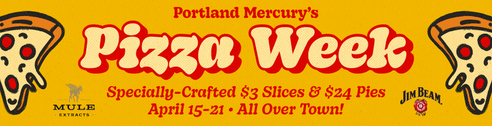

   

# It's Pizza Week in Portland

The Portland Mercury is hosting <a href="https://everout.com/portland/events/the-portland-mercurys-pizza-week-2024/e170026/">Pizza Week</a> from April 15-21, 2024 at participating locations. There are so many pizzas and so little time. To help you decided which pizzas are in your future, I've designed this web app where you can vote on which pizzas sound yummiest and plan out your pizza crawl accordingly.

## The Map

The map displays the location of each of the restaurants that meet your selection criteria from the sidebar. The number on each dot is the interest level that YOU indicate in the "Pizzas" tab (otherwise automatically set to 5 for all). The color corresponds to the cluster the restaurant was assigned to. Hovering over a point gives you more information about the pizza offered at that location. You can pan and zoom on the map as well as export a screengrab of your current view.

### What are the "clusters"?

I used kmeans clustering to group the restaurants into "clusters" based on their GPS coordinates. The number of cluster groups is editable in the sidebar with the top slider (the number of days for your pizza crawl). Unfortunately I am too lazy to figure out how to cap cluster size, so sometimes a cluster can be quite large.

## The Tables

### Pizzas

A table of all of the pizzas that meet your selection criteria from the sidebar. You can toggle between viewing only the pizzas matching your criteria and all pizzas offered during pizza week. The cells on this table are editable but you should only edit the “interest_level” column. Editing any other column will yield weird results. Double click the cell to edit and click or tab outside the table to commit the change. (I may take the time later to remove editing capabilities from other columns but for now just don’t do it.) The interest_level should be on a scale of 1 to 5.

Optional: If you want to make your votes on Google Sheets and import them here, download the pizza table as is and paste into a new (sharable!) Google Sheet. Edit the "interest_level" column values. Do not change the column name or any other info in the sheet. Finally, paste the sheet URL into the provided field, change "Use Google sheet?" to "Yes", and click the update button. The votes should auto-populate. You can further edit them in the table. If you decide you no longer want to use your Google sheet votes, just change "Use Google sheet?" to "No" and click the update button. Note: The Google sheet must be set so that general sharing permissions are set to allow anyone with the link to view the sheet, otherwise the app will not be able to access the file.

Once you have edited your selection criteria and interest levels, hit the "Update Map" button at the top left of the screen to update the map of Portland.

### Hours

A table of all of the pizzas that meet your selection criteria from the sidebar and the restaurants hours of availability. This is meant to allow you to quickly determine which days/times you can pizza crawl.

All tables are downloadable.

Code is available <a href="https://github.com/jnjahncke/food-weeks">on my Github</a>.