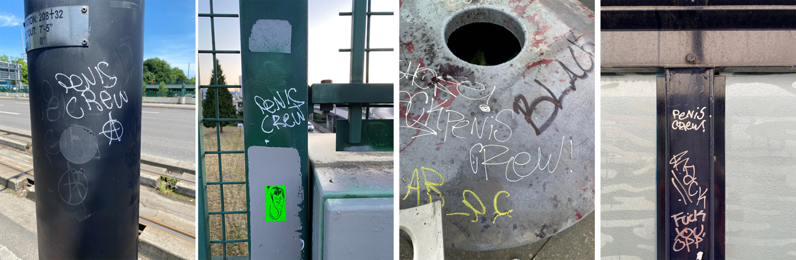

  

Self isolation during the COVID19 pandemic lockdown has impacted us all differently. A lot of us are baking bread and raising sourdough starters. Some of us (ie. me) are becoming collectors of graffiti tags. In order to try to get myself moving during the lockdown I started going on long walks around Portland. I saw a "Penis Girl" tag and thought it was funny so I snapped a picture. Soon I began seeing Penis Girl (PG) tags all over the place. After three months of collecting I accrued over 100 unique tags. It's gotten to the point that I can't really focus on anything when I'm around town because I'm busy scanning for Penis Girl tags. Soon enough I was noticing patterns and learning about Penis Girl. This page is a summary of what I've found.

# PG Territory

The territory here is going to be heavily impacted by the fact that I have not been systemmatically collecting tags and thus there are going to be more tags in the areas that I frequent and I'll miss tags in areas that I don't explore. The initial pattern that I noticed was that PG tags were most densely concentrated in SE Portland, less dense in NE Portland, and almost none in North Portland. Then I started noticing more around the riverfront and bleeding into the west side more and more. There is a high concentration of tags on Steel Bridge though I have also found tags on Hawthorne Bridge and Burnside Bridge, just less concentrated.

}}index_files/figure-html/unnamed-chunk-4-1.png" width="960" />

# Style

Most of the PG tags are just "normal" text with a few distinguishing characteristics: the loop on the "P", the "N" that almost looks like a "U" sometimes, and the curl on the "L". They also always write the "e" as lowercase whereas all the other letters are uppercase. Some of the PG tags are in a bigger "bubble" text style. In this case the "R" has a face. This style is much less common (9 out of 149 PG tags are in the bubble style).

  

# Recurring Patterns: Is "Penis Girl" more than one person?

Pretty early on I started to notice that PG tags were more than just "Penis Girl". There were recurring symbols accompanying the tag. I began to wonder if maybe Penis Girl is more than just one "Girl". These tags vary from tag to tag. Could be some kind of signature? Below are the recurring symbols:

 
### The "circle A" anarchy symbol
 
{width=70%}
 
### ATF  

{width=70%}
 
### PC  

{width=70%}
 
And then I started seeing some "PC" tags that looked *slightly* different - the "C" had a little line on it. Was this PC the same PC? (I still don't know.)
 
{width=70%}

*Update 8/30/2020: Turns out that this PC tagger is NOT Penis Girl! These tags are suspected to be by the Portland tagger "Bruce". Bruce's tags are often accompanied by "PC" and/or diamonds, often in clusters of three.* {width=70%}

So I had been sitting with the idea that maybe Penis Girl was multiple people. And then I saw it: a "Penis Crew" tag. Penis *CREW!* The style was consistent with the PG tags so I was confident it was a PG tag. Moreover...PC stands for Penis Crew! **It's multiple people!!**

 

# Occassional Added Flair

Sometimes a PG tag is more than just "Penis Girl" or "PC" or whatever. Here are some spotted tags with a little something extra to them. Hard to pick a favorite.

  

#  The PG Copycat

More recently I have started spotting tags where the style is not consistent with *the* PG style. The "P" is wrong. The capitalization is wrong. They're just wrong. Is there a copycat out there? Or is there a new member of the Penis Crew that is not conforming to style standards??

  

# What about Beanz?

As I mentioned above, there are very few PG tags in North Portland. There is, however a high density of Beanz tags in North Portland.

  

Is there a territory war between PG and Beanz? When I saw this tag in North Portland I started to think that maybe (maybe) there was.

 {width=50%} 

 
So far I've only spotted Beanz in North Portland, where there are almost no PG tags.
 
}}index_files/figure-html/unnamed-chunk-7-1.png" width="960" />

# Hate for Penis Girl & PG Farewell?

More frequently I have been seeing tags insinuating hate for PG. I often see PG tags painted over or crossed out by other taggers. Most notably, some taggers are calling PG a "snitch."

 {width=70%} 

And then I saw it...a farewell from Penis Girl?

 {width=50%} 

Let's keep our eyes peeled and see if this really is the end of PG.

